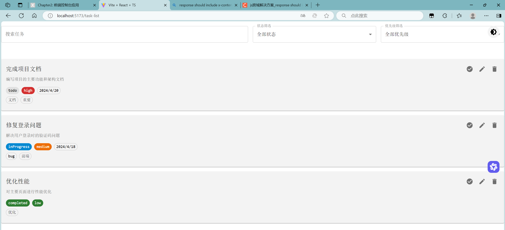

---

## Chapter3: 表单系统与任务管理

——基于 React Hook Form 和 Zod 构建现代化的表单系统

---

### 一、表单系统架构设计

项目采用分层清晰的表单组件架构：

```
frontend/src/
├── components/
│   ├── ui/
│   │   ├── common/
│   │   │   ├── forms/          # 表单基础组件
│   │   │   │   ├── BaseForm.tsx        # 表单基类
│   │   │   │   └── FormProviderWrapper.tsx  # 表单上下文包装器
│   │   │   └── form-controls/  # 表单控件
│   │   │       ├── FormInput.tsx       # 基础输入框
│   │   │       ├── GenericSelect.tsx   # 通用选择器
│   │   │       ├── DatePickerField.tsx # 日期选择器
│   │   │       ├── TagInput.tsx        # 标签输入
│   │   │       └── TagAutocomplete.tsx # 标签自动完成
│   └── task/                  # 任务相关组件
│       ├── TaskForm.tsx       # 任务表单
│       ├── TaskList.tsx       # 任务列表
│       └── TaskCard.tsx       # 任务卡片
└── types/
    └── task.ts               # 任务相关类型定义
```

**核心设计理念**：

- **组件分层**：基础表单组件与业务组件分离
- **类型安全**：使用 Zod 进行表单验证和类型推导
- **可复用性**：通用表单控件支持多种场景

---

### 二、核心实现解析

#### 1. 表单基础架构

**BaseForm 组件设计**：

```typescript
interface BaseFormProps<T extends FieldValues> {
  onSubmit: SubmitHandler<T>;
  defaultValues: DefaultValues<T>;
  schema: ZodSchema<T>;
  children: React.ReactNode;
  onFormDataChange?: (data: T) => void;
}

const BaseForm = <T extends FieldValues>({
  onSubmit,
  defaultValues,
  schema,
  children,
  onFormDataChange,
}: BaseFormProps<T>) => {
  return (
    <FormProviderWrapper<T> defaultValues={defaultValues} schema={schema}>
      {({ handleSubmit, watch }: UseFormReturn<T>) => {
        watch((data) => onFormDataChange?.(data as T));
        return <form onSubmit={handleSubmit(onSubmit)}>{children}</form>;
      }}
    </FormProviderWrapper>
  );
};
```

**关键技术点**：

- **泛型支持**：通过泛型参数`T`确保类型安全
- **表单验证**：使用 Zod Schema 进行表单验证
- **数据监听**：通过`watch`实现表单数据变化监听

---

#### 2. 任务管理系统

**任务类型定义**：

```typescript
export interface Task {
  id: string;
  title: string;
  description?: string;
  status: TaskStatus;
  dueDate?: Date;
  priority: TaskPriority;
  tags?: string[];
  createdAt: Date;
  updatedAt: Date;
}

export type TaskStatus = "todo" | "inProgress" | "completed";
export type TaskPriority = "low" | "medium" | "high";
```

**表单验证 Schema**：

```typescript
export const taskSchema = z.object({
  title: z.string().min(1, "标题不能为空"),
  description: z.string().optional(),
  status: z.enum(["todo", "inProgress", "completed"]),
  priority: z.enum(["low", "medium", "high"]),
  dueDate: z.date().optional(),
  tags: z.array(z.string()).optional(),
});
```

---

#### 3. 表单控件实现

**通用选择器组件**：

```typescript
interface GenericSelectProps {
  name: string;
  label: string;
  options: SelectOption[];
}

const GenericSelect = ({ name, label, options }: GenericSelectProps) => {
  const {
    register,
    formState: { errors },
    watch,
  } = useFormContext();

  return (
    <FormControl fullWidth margin="normal">
      <InputLabel>{label}</InputLabel>
      <Select
        label={label}
        {...register(name)}
        value={watch(name) || ""}
        error={!!errors[name]}
      >
        {options.map((option) => (
          <MenuItem key={option.value} value={option.value}>
            {option.label}
          </MenuItem>
        ))}
      </Select>
    </FormControl>
  );
};
```

**标签输入组件**：

```typescript
const TagInput = ({ name, label }: Props) => {
  const [inputValue, setInputValue] = useState("");
  const {
    setValue,
    watch,
    formState: { errors },
  } = useFormContext();
  const tags = (watch(name) || []) as string[];

  const handleAddTag = (tag: string) => {
    if (tag.trim()) {
      const newTags = [...tags, tag.trim()];
      setValue("tags", newTags);
      setInputValue("");
    }
  };

  const handleRemoveTag = (index: number) => {
    const newTags = tags.filter((_, i) => i !== index);
    setValue("tags", newTags);
  };

  return (
    <Box>
      <TextField
        label={label}
        variant="outlined"
        fullWidth
        margin="normal"
        value={inputValue}
        onChange={(e) => setInputValue(e.target.value)}
        onKeyDown={(e) => {
          if (e.key === "Enter") {
            e.preventDefault();
            handleAddTag(inputValue);
          }
        }}
        error={!!errors[name]}
        helperText={errors[name]?.message?.toString()}
      />
      <Box sx={{ mt: 1, display: "flex", flexWrap: "wrap", gap: 1 }}>
        {tags.map((tag, index) => (
          <Chip
            key={index}
            label={tag}
            onDelete={() => handleRemoveTag(index)}
          />
        ))}
      </Box>
    </Box>
  );
};
```

---

### 三、实现效果与优化方向

#### 已实现的核心功能

- **表单验证**：基于 Zod 的强类型表单验证
- **状态管理**：使用 React Hook Form 管理表单状态
- **组件复用**：通用表单控件支持多种场景
- **类型安全**：完整的 TypeScript 类型支持



---

**结语**  
通过构建这套表单系统，我们不仅实现了类型安全、可复用的表单组件，还建立了一套完整的任务管理解决方案。未来，我们将继续优化表单系统的性能和用户体验，为开发者提供更强大的工具支持。
