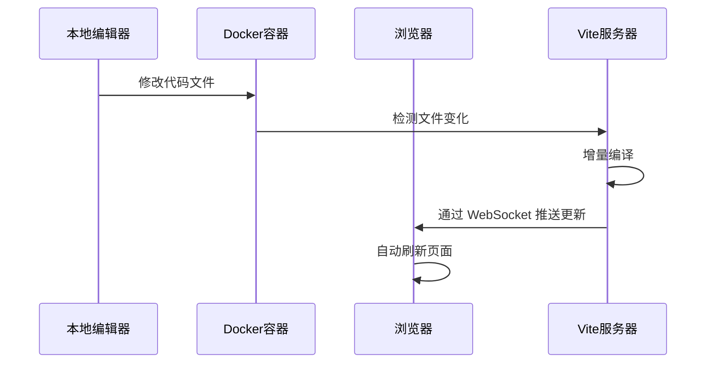

## 🎯 目标

在本篇文章中，我们将实现：

- 前端开发环境热重载
- 后端开发环境热重载
- 开发环境 Docker Compose 配置
- 调试技巧与最佳实践

## 🔄 前端热重载实现

### 1. 开发环境 Dockerfile

```dockerfile
# frontend/Dockerfile.dev
FROM node:22-alpine AS dev
WORKDIR /app
COPY frontend/package*.json ./
RUN npm install
EXPOSE 5173
CMD ["npm", "run", "dev"]
```

### 2. Vite 配置优化

```typescript
// frontend/vite.config.ts
export default defineConfig({
  server: {
    host: true, // 允许外部访问
    port: 5173,
    watch: {
      usePolling: true, // 解决容器内文件监听问题
    },
  },
});
```

### 3. 开发环境 Docker Compose 配置

```yaml
# docker-compose.dev.yml
services:
  frontend:
    build:
      context: .
      dockerfile: frontend/Dockerfile.dev
      target: dev
    volumes:
      - ./frontend:/app
      - /app/node_modules
    ports:
      - "5173:5173"
    environment:
      - NODE_ENV=development
```

## 🔄 后端热重载实现

### 1. 开发环境 Dockerfile

```dockerfile
# backend/Dockerfile.dev
FROM node:22-alpine AS development
WORKDIR /app
RUN npm install -g nodemon
COPY package*.json ./
RUN npm ci
COPY . .
CMD ["npm", "run", "start:dev:docker"]
```

### 2. Nodemon 配置

```json
// backend/nodemon.json
{
  "watch": ["src"],
  "ext": "ts,json",
  "ignore": ["src/**/*.spec.ts"],
  "exec": "ts-node src/main.ts",
  "legacyWatch": true,
  "delay": "1"
}
```

### 3. 开发环境 Docker Compose 配置

```yaml
# docker-compose.dev.yml
services:
  backend:
    build:
      context: ./backend
      dockerfile: Dockerfile.dev
    volumes:
      - ./backend:/app
      - /app/node_modules
    ports:
      - "3000:3000"
    environment:
      - NODE_ENV=development
```

## 🚀 启动开发环境

### 1. 创建启动脚本

```bash
# dev-up.bat
@echo off
docker-compose -f docker-compose.yml -f docker-compose.dev.yml up %*
```

### 2. 启动命令

```bash
# 启动所有服务
./dev-up.bat

# 仅启动前端
docker-compose -f docker-compose.yml -f docker-compose.dev.yml up frontend

# 仅启动后端
docker-compose -f docker-compose.yml -f docker-compose.dev.yml up backend
```

## 🔍 热重载工作原理



## ⚙️ 技术实现要点

| 组件             | 配置要点                          | 作用说明                   |
| ---------------- | --------------------------------- | -------------------------- |
| **Volume 挂载**  | `./frontend:/app`                 | 实时同步本地代码到容器     |
| **Node Modules** | `- /app/node_modules`             | 避免覆盖容器内依赖         |
| **Vite 配置**    | `host: true` + `usePolling: true` | 解决容器内文件监听失效问题 |
| **端口映射**     | 5173:5173                         | 直连开发服务器             |

## 🔧 常见问题与解决方案

### 1. 文件监听失效

**问题**：在 Windows 环境下，Docker 容器内的文件监听可能失效。

**解决方案**：

```typescript
// vite.config.ts
export default defineConfig({
  server: {
    watch: {
      usePolling: true,
    },
  },
});
```

### 2. 端口冲突

**问题**：开发环境端口被占用。

**解决方案**：

```yaml
# docker-compose.dev.yml
services:
  frontend:
    ports:
      - "5173:5173" # 可修改为其他可用端口
```

### 3. 环境变量加载

**问题**：开发环境变量未正确加载。

**解决方案**：

```yaml
# docker-compose.dev.yml
services:
  backend:
    env_file:
      - ./backend/.env.development
    environment:
      - NODE_ENV=development
```

## 📝 总结

通过本文，我们实现了：

1. 前端开发环境热重载
2. 后端开发环境热重载
3. 开发环境 Docker Compose 配置
4. 常见问题解决方案

这些优化大大提升了开发效率，使得在 Docker 环境中开发更加便捷。在下一篇文章中，我们将详细介绍数据库初始化与管理。
